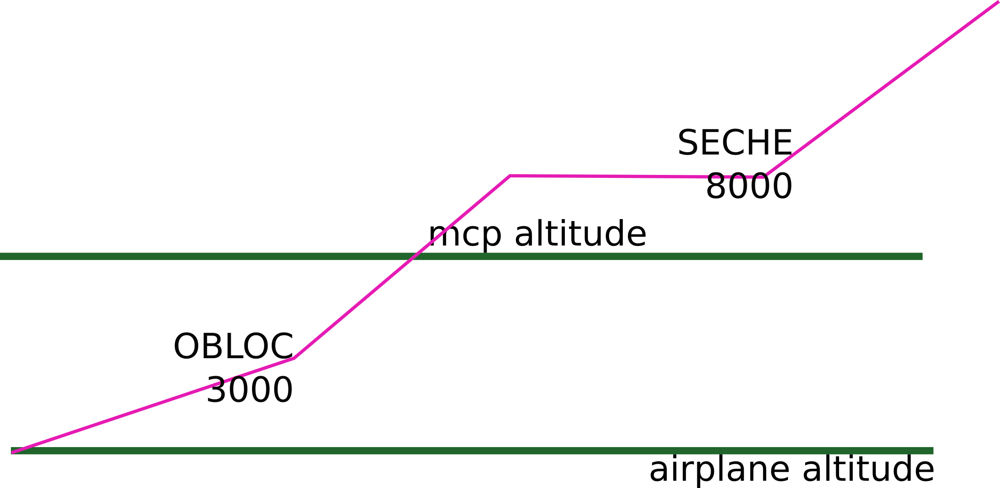
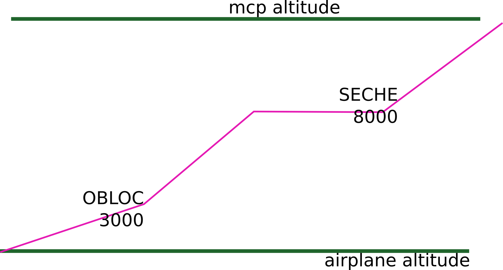

# 777 VNAV Implemenation

## Folowing VNAV restrictions

The route manager has restrictions at SECHE and OBLOC

As the MCP altitude is lower than SECHE altitude restriction, the airplane levels off at the MCP altitude

Set the MCP altitude to an altitude above SECHE restriction and push the altitude selector.

Autothrottle and pitch modes change to VNAV climb to satisfy the SECHE altitude restriction

## Using the MCP to delete FMC altitude restrictions

MCP set at 10 000

FMC still has the altitude restriction at OBLOC and SECHE

In addition to setting altitudes, the altitude selector is a momentary action switch

Each push of the altitude selector deletes 1 FMC altitude restriction between the airplane altitude and the MCP altitude

Push the altitude selector to delete the altitude restriction at OBLOC

Autothrottle and pitch modes change to VNAV climb to satisfy the next altitude restriction

Push the altitude selector again

Both altitude restrictions are deleted. Note that waypoints OBLOC and SECHE remain in the FMC flight plan.

The MCP is still set at 10 000 feet, but threre are no altitude restrictions on the route manager, and the route manager cruise altitude is FL250

Since the MCP window altitude is lower than the route manager cruise altitude, the airplane levels off at the MCP altitude
